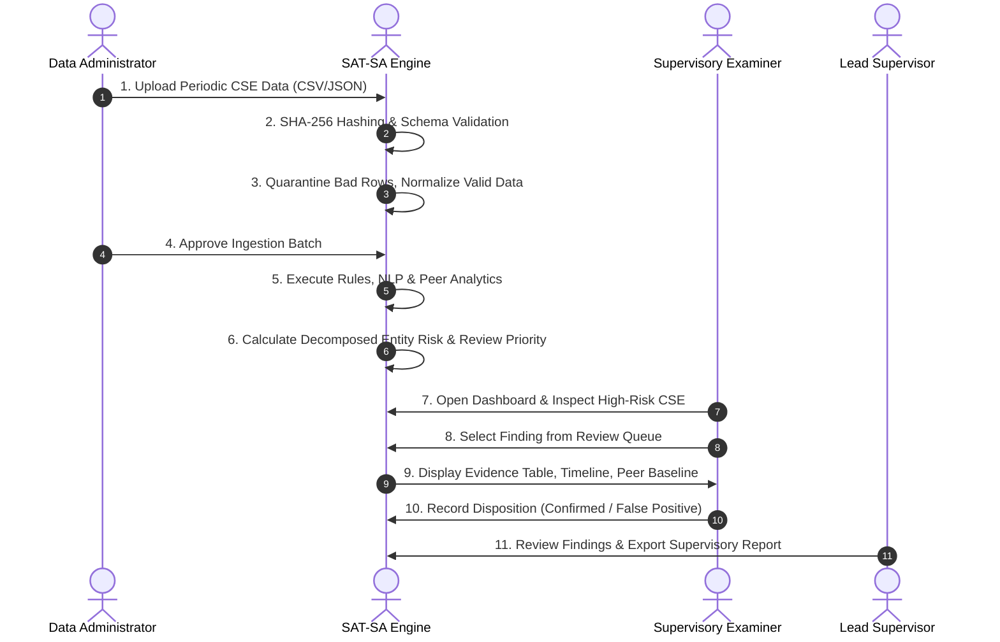

# 05. User Flow Document (UFD)

## 1. End-to-End Core Supervisory Lifecycle


## 2. Key User Journeys

### User Flow 1: Reviewing a Fast-Closure Execution Gap Finding
```
[Portfolio Dashboard]
       │
       ▼
[Click CSE-04 (High Supervisory Risk: 82/100)]
       │
       ▼
[View Risk Breakdown: 31% Fast Closures, 28% Missing Escalation]
       │
       ▼
[Open Finding F-INV-002: "Critical Alert Closed in 4 Mins"]
       │
       ▼
[Drill Down into Evidence:
 - Alert: ALT-8832 (Critical Severity)
 - Case: CASE-8832 (Closed at 4 mins after creation)
 - Investigation: 1 boilerplate note, 0 evidence attachments
 - Peer Baseline: Sector median closure is 63 mins]
       │
       ▼
[Action: Record Disposition -> "Confirmed Execution Gap"]
       │
       ▼
[Submit Comment -> Saved to Append-Only Cryptographic Audit Log]
```

### User Flow 2: Investigating Negative Space (Missing Telemetry)
```
[Portfolio Dashboard]
       │
       ▼
[Click "Negative Space Alerts" Filter]
       │
       ▼
[Select Finding F-NEG-001: "Critical Asset Silent for 21 Days"]
       │
       ▼
[Examine Evidence:
 - Asset: AST-104 (Criticality: Critical, Role: Core OT Controller)
 - Monitoring Expected: True
 - Operational Records: Zero telemetry/alerts in period
 - Peer Baseline: Comparable OT assets average 4.2 alerts/month]
       │
       ▼
[Action: Mark "Remediation Required: Request Sensor Logs from CSE"]
```

### User Flow 3: Batch Data Submission & Quality Review
```
[Submissions Tab]
       │
       ▼
[Select CSE & Reporting Period (e.g. 2026-Q3)]
       │
       ▼
[Drag & Drop 6 CSV Files (alerts, cases, assets, steps, escalations, coverage)]
       │
       ▼
[System computes SHA-256 checksums & evaluates DQ-001 to DQ-012]
       │
       ├── Clean rows -> Staged for normalization
       └── Malformed rows -> Logged to Quarantine Viewer
       │
       ▼
[Admin clicks "Approve Ingestion & Run Supervisory Analytics"]
```
