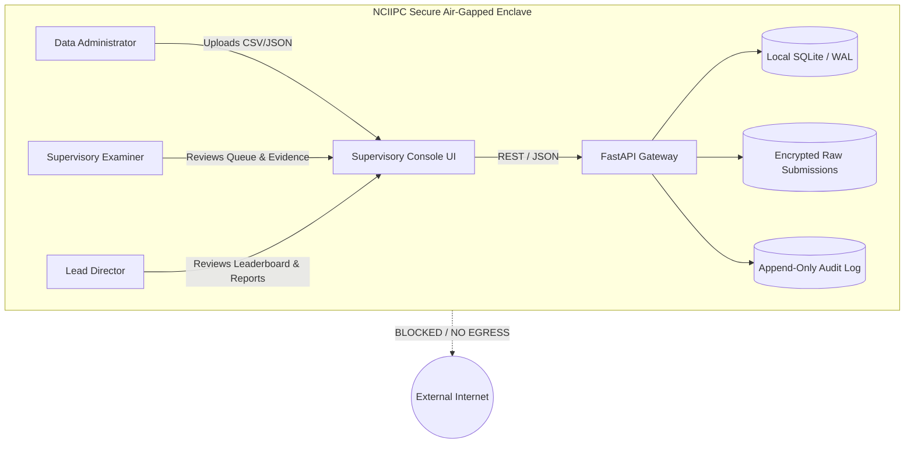

# 09. High-Level Architecture Document (HLD / SAD)

---

# PART 1: TWO-PAGE EXECUTIVE ARCHITECTURE DOCUMENT (SIH SUBMISSION FORMAT)

## 1. Problem Summary & Solution Concept
The National Critical Information Infrastructure Protection Centre (NCIIPC) assesses the cyber resilience of Critical Sector Entities (CSEs). While organizations maintain polished compliance manuals and high-level SLA metrics, operational evidence frequently hides severe execution breakdowns: critical alerts closed in minutes without triage, unescalated high-severity incidents, boilerplate copy-pasted notes, and unmonitored "negative-space" assets.

**SAT-SA (Supervisory Analytics Tool for SOC Assessment)** is an offline, air-gapped supervisory analytics system designed to evaluate periodic structured SOC submissions, discover execution gaps, compute transparent decomposed risk scores, and prioritize expert human manual review without cloud dependencies.

## 2. High-Level Architecture Diagram
```
┌────────────────────────────────────────────────────────────────────────┐
│               NCIIPC Controlled Air-Gapped Environment                 │
│                                                                        │
│  ┌──────────────────────────────────────────────────────────────────┐  │
│  │                    Web UI / Supervisor Console                   │  │
│  │    Portfolio View • Review Queue • Evidence Drill-Down • Reports │  │
│  └──────────────────────────────────┬───────────────────────────────┘  │
│                                     │ HTTPS / Local HTTP               │
│  ┌──────────────────────────────────▼───────────────────────────────┐  │
│  │                          FastAPI Backend                         │  │
│  │            Local RBAC • Session Management • REST APIs           │  │
│  └──────────────────┬───────────────────────────────┬───────────────┘  │
│                     │                               │                  │
│  ┌──────────────────▼───────────┐       ┌───────────▼───────────────┐  │
│  │        Ingestion Layer       │       │  Hybrid Analytics Engine  │  │
│  │  CSV/JSON Parsers • Hashing  │       │  Deterministic Rules      │  │
│  │  Data Quality Rules (DQ-012) │       │  Negative-Space Detector  │  │
│  │  Canonical Normalization     │       │  NLP TF-IDF Similarity    │  │
│  │  Quarantine Isolated Store   │       │  Peer Benchmarking (MAD)  │  │
│  └──────────────────┬───────────┘       │  Isolation Forest ML      │  │
│                     │                   └───────────┬───────────────┘  │
│                     │                               │                  │
│  ┌──────────────────▼───────────────────────────────▼───────────────┐  │
│  │                        Local Data Layer                          │  │
│  │  SQLite WAL (Canonical Tables) • Audit Store (SHA-256 Chained)   │  │
│  └──────────────────────────────────────────────────────────────────┘  │
│                                                                        │
│        Zero Cloud Dependency • Zero Telemetry Egress • 100% Offline    │
└────────────────────────────────────────────────────────────────────────┘
```

## 3. Major System Components
1. **Data Intake & Quality Layer**:
   - Ingests periodic batches of CSV/JSON files.
   - Computes SHA-256 file hashes to guarantee provenance.
   - Validates data-quality constraints (`DQ-001` through `DQ-012`) and diverts malformed records to an isolated quarantine store.
2. **Canonical Normalization Engine**:
   - Transforms heterogeneous entity fields into standardized alerts, cases, assets, and escalation records with UTC timestamp normalization.
3. **Hybrid Supervisory Analytics Engine**:
   - Executes deterministic policy rules (`R-ESC-001`, `R-INV-002`, `R-INV-001`, `R-REM-001`).
   - Models negative space (`R-NEG-001`) to detect silent critical assets ($C_{asset} = 0$).
   - Vectorizes case notes using local scikit-learn TF-IDF to identify copy-pasted boilerplate.
   - Computes non-parametric sector peer distributions (Median, IQR, Percentile ranks).
4. **Prioritization & Scoring Engine**:
   - Computes transparent decomposed risk: $R_{entity} = w_D D + w_I I + w_E E + w_N N + w_P P + w_Q Q$.
   - Prioritizes examiner review queue by severity, evidence completeness, impact, and novelty.
5. **Cryptographic Audit & Evidence Store**:
   - Every human disposition and configuration change is logged into an append-only table chained with SHA-256 integrity hashes.
6. **Local Presentation Console**:
   - Single-page supervisory interface built with zero external CDN dependencies, offering full drill-down to raw records and printable report export.

---

# PART 2: DETAILED HIGH-LEVEL ENGINEERING SPECIFICATION

## 1. System Context & Trust Boundaries


## 2. Technology Choices & Rationale
| Layer | Choice | Rationale |
|---|---|---|
| **Web UI** | HTML5 / Vanilla JS / Modern CSS / Embedded SVGs | Zero external CDN dependencies; renders instantaneously; immune to remote script supply-chain vulnerabilities |
| **Application API** | Python FastAPI + Uvicorn | Native integration with scientific Python libraries; async I/O; automatic OpenAPI documentation |
| **Data Processing** | Python 3 + NumPy | High-performance vectorization and batch normalization |
| **Analytics & NLP** | Scikit-learn + SciPy | 100% offline; TF-IDF vectorizer + Cosine Similarity; Isolation Forest; robust statistical routines |
| **Persistence** | SQLite with WAL (Write-Ahead Logging) | Serverless, zero configuration, embedded ACID reliability, robust transaction performance |
| **Cryptographic Audit** | Standard library `hashlib` (SHA-256) | Tamper-evident chaining of audit events without requiring blockchain overhead |
| **Packaging** | Docker Compose + Standalone Python Runner | Deterministic offline packaging, air-gap installation compliance |

## 3. Hardware Requirements
| Configuration | CPU Cores | RAM | Storage | GPU |
|---|---|---|---|---|
| **Demo / Evaluation** | 4 Cores | 8 GB | 20 GB SSD | Not Required |
| **Production Enclave**| 8–16 Cores | 32 GB | 500 GB–2 TB SSD | Not Required |
