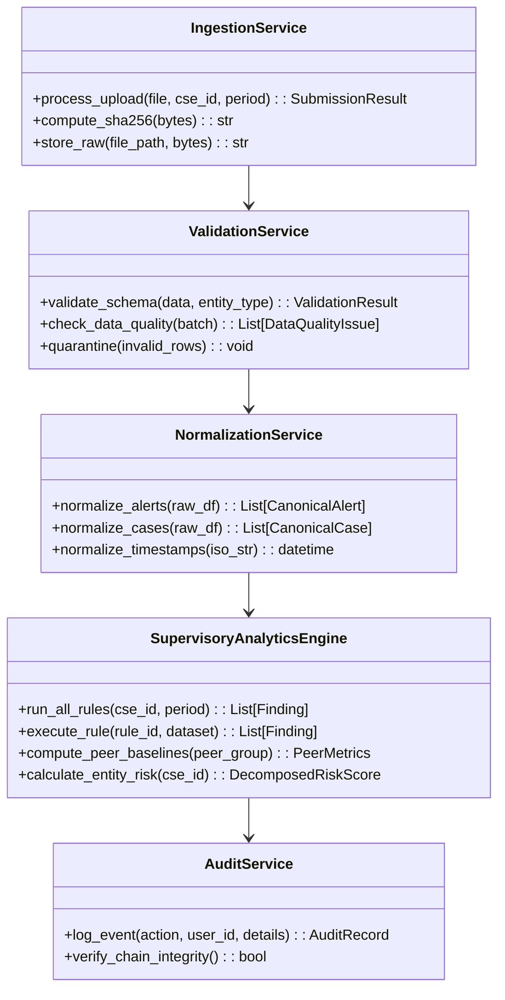

# 10. Low-Level Design Document (LLD)

## 1. Class & Service Architecture


## 2. Ingestion & Validation Pipeline Details
1. **File Intake**: Client uploads multipart files via `/api/v1/submissions/upload`.
2. **Integrity Lock**:
   ```python
   hasher = hashlib.sha256()
   hasher.update(file_bytes)
   file_hash = hasher.hexdigest()
   ```
3. **Quarantine Routing**: Records failing primary key uniqueness (`DQ-002`), referential links (`DQ-005`, `DQ-006`), or chronological monotonicity (`DQ-003`, `DQ-004`) are saved to `data_quality_issues` with status `QUARANTINED` and omitted from the active analytics dataset.
4. **Canonical Ingestion**: Valid records are inserted into SQLite via parameterized statements within a single atomic database transaction.

## 3. Rule Engine Execution Lifecycle
- **Step 1: Context Preparation**: The engine loads alerts, cases, assets, and escalations for the target CSE and retrieves current sector peer benchmarks.
- **Step 2: Rule Evaluation**: Each rule module executes its vectorized evaluation:
  - `CriticalAlertNoEscalationRule`: Left-joins alerts on cases and escalations; filters for Critical severity lacking an escalation record within 60 minutes.
  - `HighSeverityFastClosureRule`: Calculates $(T_{closed} - T_{created})$; compares against 10-minute cutoff and sector 5th percentile.
  - `RepetitiveInvestigationRule`: Extracts all non-empty case summaries; constructs TF-IDF matrix; computes pairwise cosine distances; groups pairs exceeding 0.85 similarity.
  - `NegativeSpaceRule`: Identifies assets marked `monitoring_expected = True` where count of alerts or telemetry events is zero during the period.
- **Step 3: Finding Materialization**: Findings are assigned a unique ID (`F-XXX-XXXXX`), tagged with rule version, linked to supporting record IDs, and saved to the database.
- **Step 4: Score Aggregation**: Entity risk sub-scores ($D, I, E, N, P, Q$) are updated and the review queue is re-indexed.

## 4. Audit Chaining Implementation
```python
def log_event(db, action: str, user_id: str, payload: dict) -> str:
    last_event = db.execute("SELECT hash FROM audit_events ORDER BY id DESC LIMIT 1").fetchone()
    prev_hash = last_event["hash"] if last_event else "GENESIS_BLOCK_0000000000000000"
    
    timestamp = datetime.utcnow().isoformat()
    raw_payload = json.dumps(payload, sort_keys=True)
    
    event_str = f"{prev_hash}|{timestamp}|{action}|{user_id}|{raw_payload}"
    curr_hash = hashlib.sha256(event_str.encode("utf-8")).hexdigest()
    
    db.execute(
        "INSERT INTO audit_events (timestamp, action, user_id, payload, prev_hash, hash) "
        "VALUES (?, ?, ?, ?, ?, ?)",
        (timestamp, action, user_id, raw_payload, prev_hash, curr_hash)
    )
    return curr_hash
```
