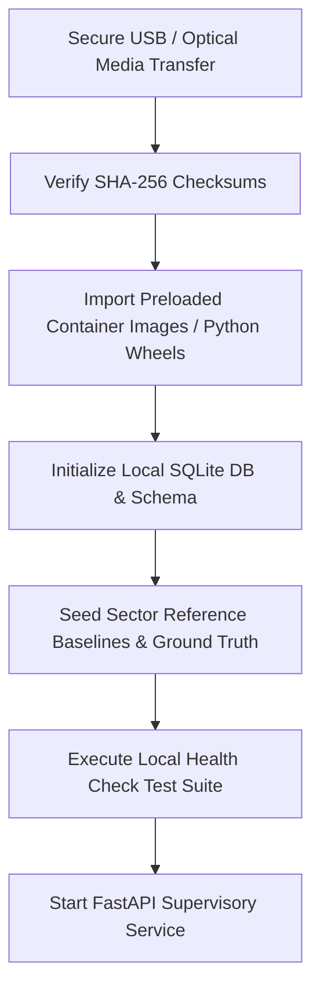

# 16. Deployment & Installation Guide (DGD)

## 1. Supported Deployment Environments
SAT-SA is engineered to deploy in isolated, air-gapped server environments within NCIIPC / NTRO enclaves.

### Hardware Prerequisites
| Metric | Minimum Demo / Lab | Recommended Enclave Pilot |
|---|---|---|
| **CPU** | 4 Cores (x86_64 or ARM64) | 8–16 Cores |
| **RAM** | 8 GB RAM | 32 GB RAM |
| **Disk Storage** | 20 GB NVMe / SSD | 500 GB–2 TB NVMe / SSD |
| **GPU** | Not Required | Optional for large batch NLP |
| **Network Interface** | Local loopback / Isolated Enclave VLAN | Air-gapped enclave; egress blocked |

## 2. Air-Gapped Package Verification Flow


## 3. Step-by-Step Installation Instructions

### Option A: Direct Python Execution (Standard Enclave Workstation)
1. **Extract Release Archive**:
   ```bash
   tar -xvf sat-sa-v1.0.0-airgap.tar.gz
   cd sat-sa
   ```
2. **Install Vendored Wheels (Offline)**:
   ```bash
   pip install --no-index --find-links=./offline-wheels -r requirements.txt
   ```
3. **Initialize Database & Seed Synthetic Profiles**:
   ```bash
   python run.py --seed
   ```
4. **Launch Supervisory Service**:
   ```bash
   python run.py --port 8000
   ```
5. **Verify Local Web UI**:
   Open browser at `http://127.0.0.1:8000`.

### Option B: Docker Compose Deployment (Containerized Enclave Server)
1. **Load Pre-built Images from Archive**:
   ```bash
   docker load -i offline-images/sat-sa-backend.tar
   ```
2. **Deploy Service Stack**:
   ```bash
   docker-compose -f infrastructure/docker/docker-compose.yml up -d
   ```
3. **Confirm Zero Egress Status**:
   ```bash
   docker inspect sat-sa-backend | grep -i network
   # Verify isolated bridge with internal DNS only
   ```

## 4. Verification & Health Checks
Run the built-in self-test command:
```bash
python run.py --healthcheck
```
Expected output:
```
[PASS] SQLite Database connection and schema verified.
[PASS] Cryptographic audit chain verified (Genesis block intact).
[PASS] Scikit-learn TF-IDF and Isolation Forest modules loaded.
[PASS] Zero external socket egress confirmed.
[OK] SAT-SA Ready for Supervisory Ingestion.
```
