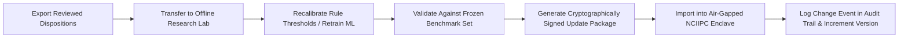

# 20. Release, Versioning & Change Management Plan

## 1. Versioning Architecture
To preserve 100% legal auditability and regulatory repeatability across multi-year assessment cycles, SAT-SA uses strict multi-layer semantic versioning:

```
Application Version:              1.0.0
Database Schema Version:          1.0.0
Supervisory Rules Engine Version: 1.2.0
Peer Benchmark Baseline Version:  2026-Q3-v1
Local ML Model Version:           isolation-forest-1.0.0
Synthetic Benchmark Package:      groundtruth-1.0.0
```

## 2. Finding Reproducibility Contract
Every supervisory finding stored in the database is tagged with:
1. `submission_id`: Pointer to the exact source submission batch.
2. `submission_file_hash`: Cryptographic SHA-256 hash of the submitted CSV/JSON.
3. `rule_id` and `rule_version`: Exact version of the detection logic executed.
4. `peer_baseline_version`: Sector distribution snapshot used for percentile comparison.
5. `analytics_run_id`: Execution run identifier with exact UTC timestamp.

This ensures that even if rules or thresholds are recalibrated in 2027, an assessment generated in 2026 can be re-executed with bit-for-bit identical results.

## 3. Offline Model & Rule Calibration Lifecycle


## 4. Rollback Procedures
- **Database Rollback**: Point-in-time restore from verified SQLite snapshot.
- **Rule Rollback**: If a revised rule yields excessive false positives, administrators can revert the active rule configuration to the previous version with one click.
