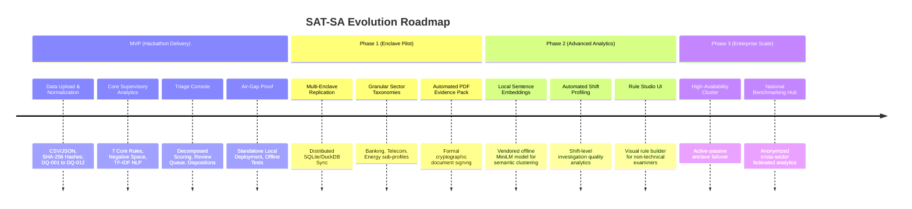

# 22. Limitations & Strategic Product Roadmap

## 1. System Limitations & Honest Technical Boundaries
A credible supervisory tool must explicitly acknowledge its operational assumptions and boundaries:

1. **Prioritization Signals, Not Unilateral Proof**:
   - An alert closed in 4 minutes or a critical asset producing zero telemetry is a *supervisory risk signal*, not definitive proof of negligence. Operational explanations (e.g. planned maintenance, authorized duplicate deduplication) may exist, which is why human examiner adjudication is mandatory.
2. **Dependence on Submission Completeness**:
   - The quality of negative-space analysis directly depends on the completeness of the declared asset inventory. If an entity omits an asset from its declared inventory, the system cannot detect its silence.
3. **NLP Language Nuances**:
   - TF-IDF similarity flags repetitive investigation notes. However, standardized Standard Operating Procedure (SOP) phrasing (e.g., standard routine antivirus false-positive cleanups) may naturally score high similarity without implying poor investigation.
4. **Offline Environment Boundary**:
   - The platform strictly adheres to air-gapped constraints and does not query external threat intelligence APIs (e.g. VirusTotal or AlienVault OTX) at runtime.

## 2. Multi-Phase Product Roadmap

